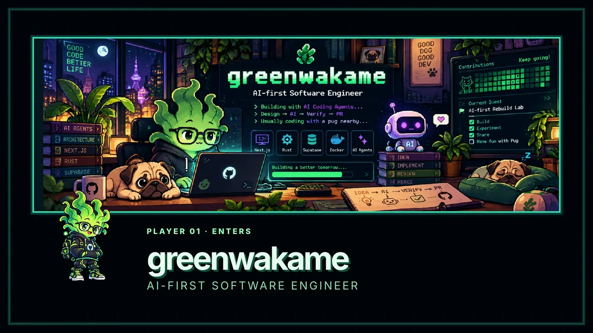
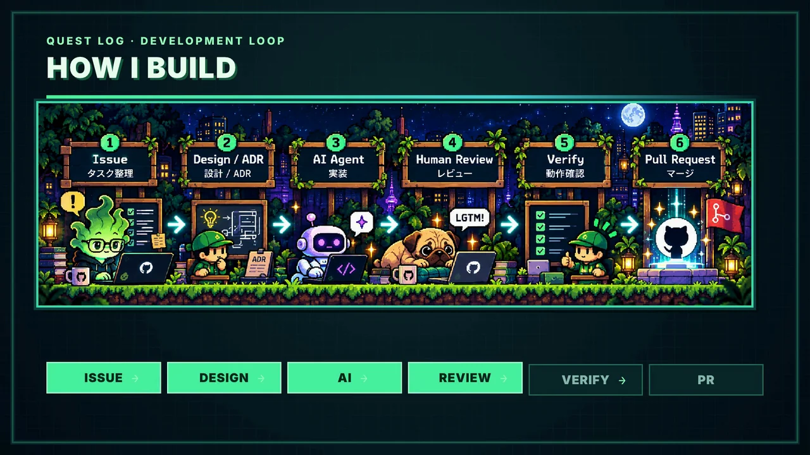
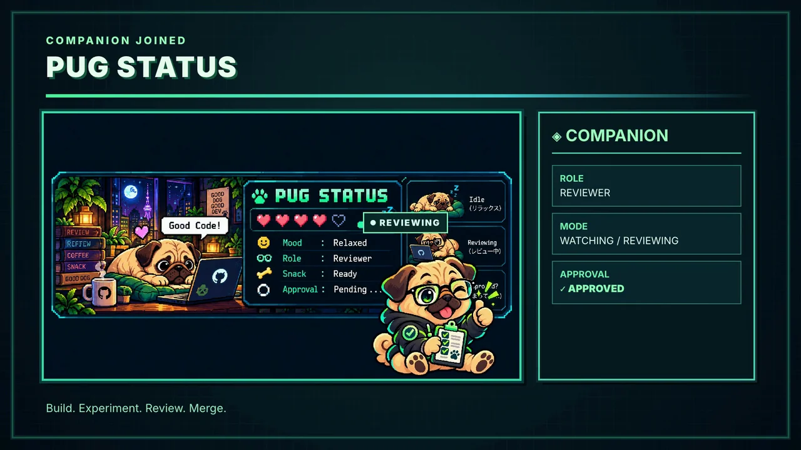
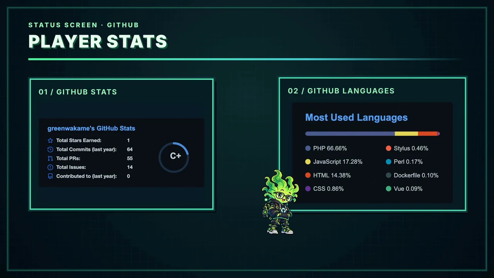

# greenwakame Profile PV

## 完成物

[20秒の公開用MP4を見る](media/greenwakame-profile-pv-v6-github.mp4)

**H.264 · 1920×1080 · 30 fps · 600フレーム · 20.000秒 · 音声なし · 8,100,111 bytes**

GitHubプロフィールとAI-firstな制作フローを、6シーンのRPG風世界として表現したPVです。greenwakameがプレイヤーとして画面を進み、Pug Reviewerがレビューと承認の場面を担います。HyperFramesとcoding agentを使って制作し、check、Studio Preview、人の目による確認、render、FFprobeによる実測を経て完成しました。

## 目的と制約

目的は、プロフィールページ全体を読まなくても、20秒で人物像と制作スタイルが伝わることでした。制作上の制約は**1920×1080、30 fps、音声なし、外部の有料AIサービスを使用しないこと、再現可能なローカル環境、最終render前のHuman Visual QA**です。完成PVに含まれる作品固有メディアは、リポジトリ所有者がGitHubでの公開を承認済みです。再利用条件と第三者コンテンツの扱いは[RIGHTS-AND-CREDITS.md](../../RIGHTS-AND-CREDITS.md)を参照してください。

## シーン構成

| シーン | 時間 | 内容 |
| --- | --- | --- |
| 1 · Player Enters | 0–3秒 | プロフィールのheaderとgreenwakameがプレイヤーを紹介。 |
| 2 · How I Build | 3–7秒 | Issue → Design → AI → Human Review → Verify → PRの制作ループ。 |
| 3 · Pug Status | 7–11秒 | Pug Reviewerがreviewingとpendingを経て承認へ。 |
| 4 · Current Quest | 11–15秒 | 現在のプロジェクトと技術スタックをquest画面に。 |
| 5 · Player Stats | 15–18秒 | greenwakameがStatsからLanguagesへ移動し、各UIの反応を起こす。 |
| 6 · Outro | 18–20秒 | greenwakameとPugがparty-completeの画面に収まる。 |

## v1からv6まで

各版は別々の完成品ではなく、判断を重ねた過程です。

1. **v1:** 20秒のゲーム/RPG風UIの骨格を制作。
2. **v2:** greenwakameとPug Reviewerを追加。
3. **v3:** キャラクターのstateをUIのstateと連動。
4. **v4:** キャラクターの行動をUI変化の原因にする設計へ変更。
5. **v5:** AI生成poseを増やしたが、見た目の連続性が悪化。
6. **v6:** v4の構造を基に、少数の安定spriteとtransform中心の演技へ再構築。

[各版の詳しい記録](ITERATIONS.md)。

## v5で起きた問題

追加spriteごとに、顔、等身、手足、小物、輪郭、重心が微妙に異なりました。高速で切り替えると「同じキャラクターが動く」よりも「似たキャラクターへ交換される」ように見え、特にPugの場面で目立ちました。一方、記録上のlintとruntimeのerrorは0件でした。**check passed ≠ animation looks good**。問題を発見したのはStudio PreviewとHuman Visual QAです。

## v6で変えたこと

greenwakameは基本の`idle`、`walk-a`、`walk-b`、`review`、`success`に、Pugは`reviewing`、`pending`、`approved`に絞りました。画像を頻繁に替える代わりに、移動、回転、squash、jump、landing、小さなidle motionで演技を作りました。予備動作と着地後の落ち着きを入れ、Player Statsではキャラクターのleanから**120 ms後**に各カードを反応させました。[設計の詳細](DESIGN.md) · [一般化したナレッジ](../../docs/animation-design.md)。

## 得られたこと

- 技術的なcheckは必要。ただし、動きが自然かどうかはHuman Visual QAで判断する。
- poseの数より、キャラクターの同一性が重要。
- 小さな演技も**anticipation → action → settle**で読みやすくなる。
- キャラクターの後にUIが反応すると、原因と結果が伝わる。
- 動作する旧版を残したため、v4を土台にv6を再構築できた。

## 検証と最終ファイル

v6で記録されたHyperFramesの結果は**Lint: error 0 / warning 9、Runtime: error 0 / warning 0**でした。warningの件数だけで安全と判断したわけではありません。masterの実測は20.000秒、1920×1080、30 fps、600フレーム、14,768,600 bytes。[公開用MP4](media/greenwakame-profile-pv-v6-github.mp4)は同じ尺・画面仕様のH.264で、音声ストリームなし、8,100,111 bytesです。

このリポジトリにはdeliveryファイル、poster、説明用静止画3枚を置きました。masterと旧版は制作環境に残しています。[検証手順](../../docs/validation-and-render.md) · [delivery encode](../../docs/github-delivery.md) · [権利状況](../../RIGHTS-AND-CREDITS.md)。
